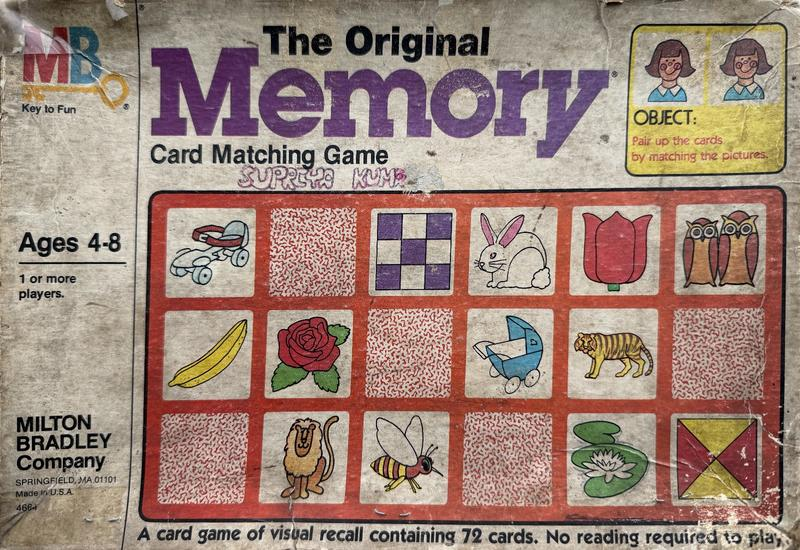

# Membery

A digital recreation of Milton Bradley's **"The Original Memory"** card matching game.

**[Play it live](https://goodrobot.ai/membery/)**



## About

This game was recreated from photographs of the physical tiles from a childhood copy of the game. The 36 tile pairs were extracted from the photos, perspective-corrected, and deskewed to produce faithful digital versions of the original hand-drawn watercolor artwork.

## How to play

- Flip two cards by tapping/clicking them
- If they match, they stay face-up
- If they don't, they flip back after a moment
- Find all pairs to win

Three difficulty levels:
- **Easy** — 12 pairs (24 cards)
- **Medium** — 18 pairs (36 cards)
- **Hard** — 36 pairs (72 cards)

## Running locally

Open `web/index.html` in a browser, or serve with any static file server:

```
cd web
python3 -m http.server 8765
```

Then visit http://localhost:8765

## Structure

```
web/
├── index.html          # Game page with splash screen
├── style.css           # Styling (mobile-first, responsive)
├── game.js             # Game logic
├── cover.jpg           # Original box art (rectified)
└── tiles_clean/        # 36 deskewed tile images
source_images/          # Original photographs
.github/workflows/      # GitHub Pages deployment
```
